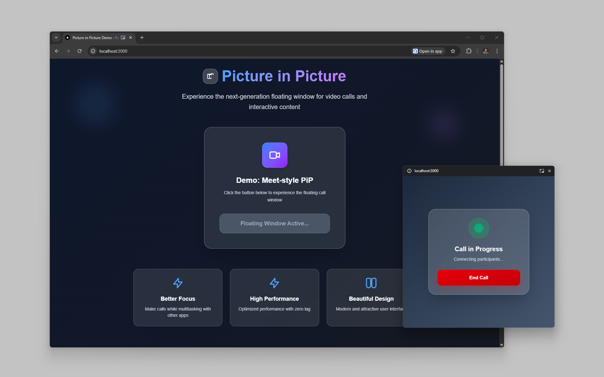

# 🖼️ Modern and New Picture in Picture Version | Document Picture in picture API



A modern **Picture-in-Picture (PiP)** demonstration application built with Next.js that showcases the Document Picture-in-Picture API. Experience the next-generation floating window for video calls and interactive content with seamless multitasking capabilities.

## Demo 
You can check out the demo at this link:  
[https://modern-picture-in-picture.vercel.app/](https://modern-picture-in-picture.vercel.app/)

Important: Make sure to use a browser that supports Document Picture-in-Picture, such as Chrome, Edge, or Safari.

## ✨ Features

### 🎯 **Better Focus**
Make video calls while multitasking with other applications without losing sight of your conversation.

### ⚡ **High Performance**
Optimized performance with zero lag, ensuring smooth operation of the floating window.

### 🎨 **Beautiful Design**
Modern and attractive user interface with glassmorphism effects and smooth animations.

### 🔧 **Technical Features**
- **Document Picture-in-Picture API** implementation
- **React 19** with TypeScript support
- **TailwindCSS** for modern styling
- **Responsive design** for all screen sizes
- **Real-time window management**
- **Cross-browser compatibility** (where supported)

## 🚀 Quick Start

### Prerequisites
- Node.js 18+ 
- Modern browser with Document PiP API support (Chrome 116+, Edge 116+)

### Installation

1. **Clone the repository**
   ```bash
   git clone https://github.com/fariborz0015/picture-in-picture.git
   cd picture-in-picture
   ```

2. **Install dependencies**
   ```bash
   npm install
   ```

3. **Start the development server**
   ```bash
   npm run dev
   ```

4. **Open your browser**
   Navigate to [http://localhost:3000](http://localhost:3000)

### Available Scripts

```bash
npm run dev      # Start development server with Turbopack
npm run build    # Build for production
npm run start    # Start production server
npm run lint     # Run ESLint
```

## 🎮 How to Use

1. **Open the application** in a supported browser
2. **Click the "Open Picture-in-Picture" button** on the main demo card
3. **Allow the PiP window** when prompted by your browser
4. **Enjoy the floating call window** that you can move around your screen
5. **End the call** using the red button in the PiP window

## 🌐 Browser Support

| Browser | Version | Support |
|---------|---------|---------|
| Chrome  | 116+    | ✅ Full |
| Edge    | 116+    | ✅ Full |
| Firefox | -       | ❌ Not yet |
| Safari  | -       | ❌ Not yet |

> **Note**: The Document Picture-in-Picture API is currently supported in Chromium-based browsers only.

## 🛠️ Technology Stack

- **Framework**: [Next.js 15.4.5](https://nextjs.org/)
- **UI Library**: [React 19](https://react.dev/)
- **Language**: [TypeScript 5](https://www.typescriptlang.org/)
- **Styling**: [TailwindCSS 4](https://tailwindcss.com/)
- **Icons**: [Iconify React](https://iconify.design/)
- **Build Tool**: [Turbopack](https://turbo.build/pack)

## 📁 Project Structure

```
picture-in-picture/
├── public/
│   ├── screen.png              # Demo screenshot
│   └── ...                     # Other static assets
├── src/
│   └── app/
│       ├── components/
│       │   └── PipCallWindow.tsx   # Main PiP component
│       ├── globals.css         # Global styles
│       ├── layout.tsx          # Root layout
│       └── page.tsx            # Main demo page
├── package.json
└── README.md
```

## 🔮 API Reference

### Document Picture-in-Picture API

The application uses the experimental Document Picture-in-Picture API:

```typescript
const pipWindow = await window.documentPictureInPicture.requestWindow({
  width: 480,
  height: 480,
});
```

### Key Components

#### `PipCallWindow`
The main component rendered inside the PiP window.

```typescript
interface PipCallWindowProps {
  onEndCall?: () => void;
}
```

## 🤝 Contributing

Contributions are welcome! Please feel free to submit a Pull Request.

1. Fork the project
2. Create your feature branch (`git checkout -b feature/AmazingFeature`)
3. Commit your changes (`git commit -m 'Add some AmazingFeature'`)
4. Push to the branch (`git push origin feature/AmazingFeature`)
5. Open a Pull Request

## 📝 License

This project is open source and available under the [MIT License](LICENSE).

## 👨‍💻 Developer

**Fariborz**

- 🌐 **Website**: [fariborzz.ir](https://fariborzz.ir)
- 💼 **LinkedIn**: [fariborzamm](https://www.linkedin.com/in/fariborzamm)
- 🔗 **GitHub**: [fariborz0015](https://github.com/fariborz0015)

---

<div align="center">
  <p>Built with ❤️ for better user experience</p>
  <p>⭐ Star this repository if you found it helpful!</p>
</div>
